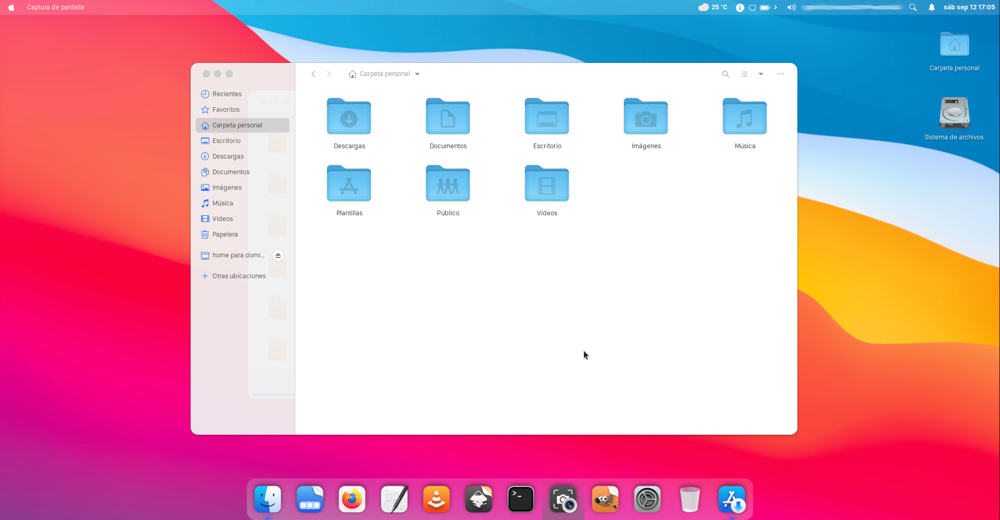

# Linux Installers

These are several Linux post install scripts y have prepared over the years. Lately I have been required to do a lot of Linux installations for me and others so I have dug up many scripts, updated a few and added a few others.

---

## Available Installers (uploads still in progress)

1. Manjaro XFCE BigSur

  Customize Manjaro XFCE for the look and feel of Big Sur (in progress)



```
XFCESur.sh
```

2. Elementary Hera

  Customize Hera with the most important software to have a top-notch Office desktop

```
Elementary_Install.sh
```

3. Regolith

  Customize Regolith to have an excellent distraction free programming tile window manager (not uloaded yet)

---

All files do consider fresh installs of the respective distros before starting an install script. Constributions are welcome.

Have fun.
