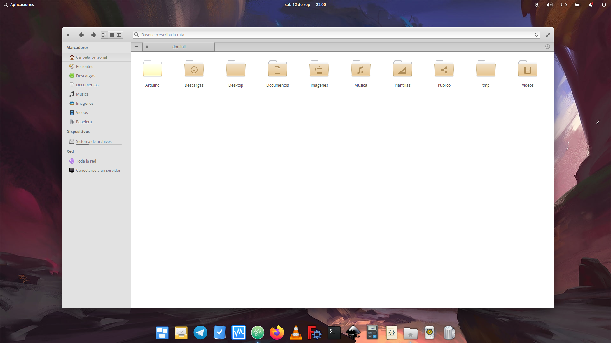
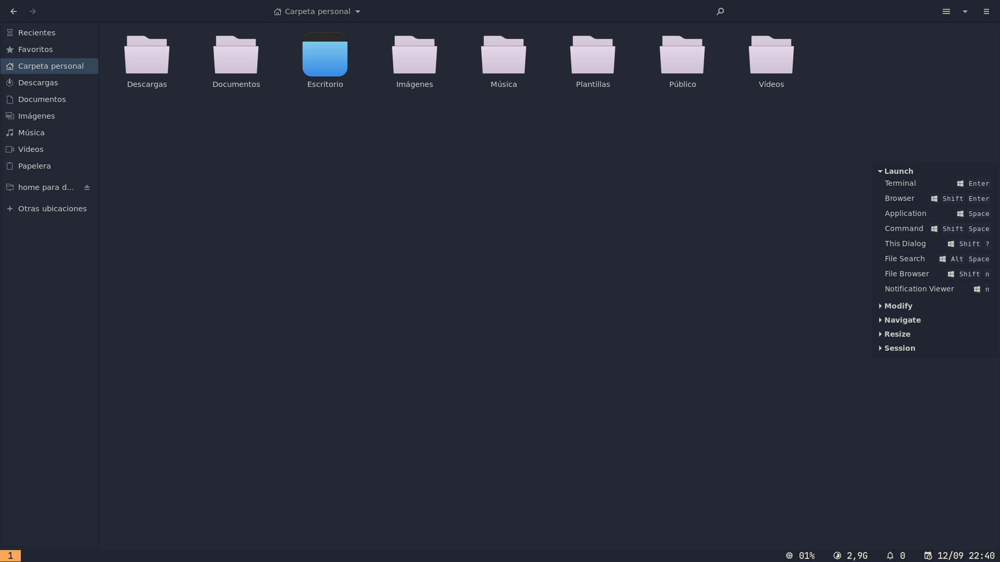

# Linux Installers

These are several Linux post install scripts I have prepared over the years. Lately I have been required to do a lot of Linux installations for me and others so I have dug up many scripts, updated a few and added a few others.

---

## Available Installers (uploads still in progress)

1. **Manjaro XFCE BigSur**

  This script is outdated!


2. Elementary 8.0 "Circe"

  Customize Circe with the most important software to have a top-notch Office desktop

  

```
elementary.sh
```

> Why choose Elementary for this task? This is because Elementary is based on Ubuntu and thus has the possibility to enable many popular PPAs (not neccessarily curated but functional) to enhance the desktop experience, specially for Linux newbies.

You may want to execute this installer remotely with the following command line (curl would be easier, but it's not installed per default on Odin)

```
  wget -qO- "https://raw.githubusercontent.com/dsancheznet/linux-installers/master/elementary.sh" | bash
```

3. Regolith

 This is outdated! I'm using hyperland now, so I will not update the regolith script, since this spin is based on i3.
 
  


```
install_Regolith.sh
```

---

All files do consider fresh installs of the respective distros before starting an install script. Constributions are welcome.

Have fun.
